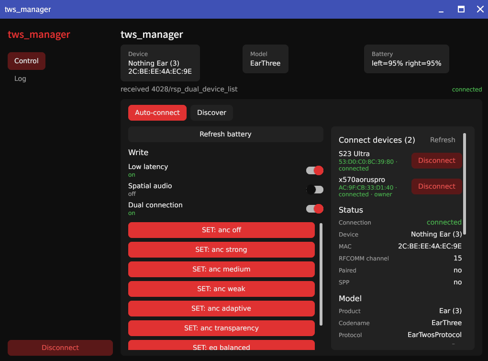
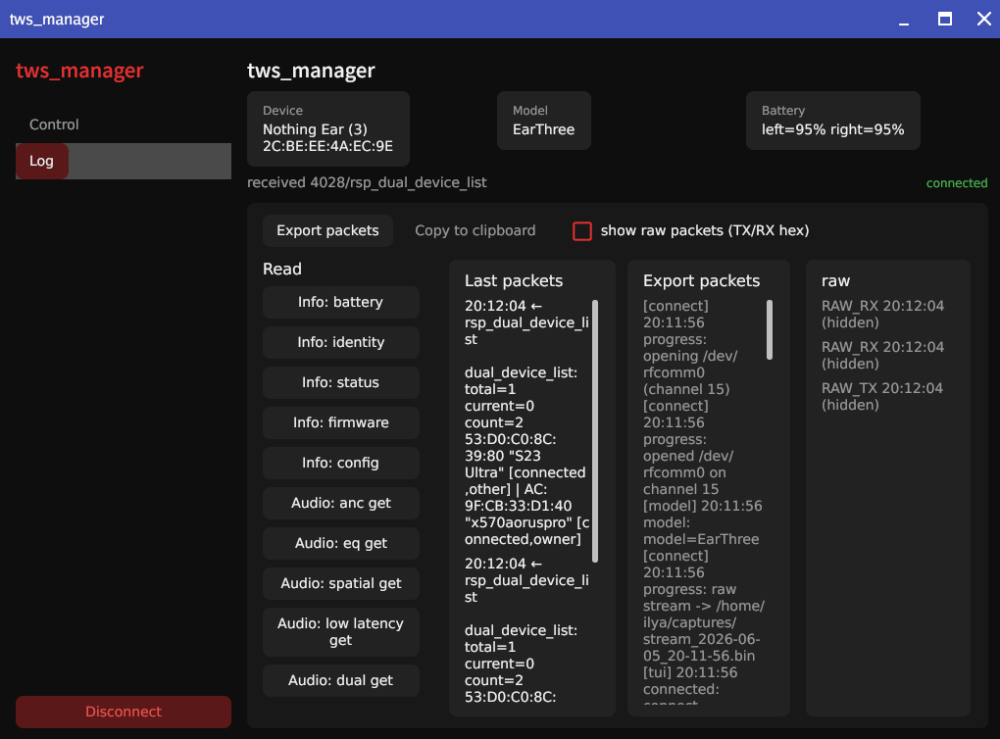

# Клиент для управления Nothing наушниками

###  скорее всего он работает со всеми, но в этом нет абсолюной уверенности, поэтому буду рад баг репортам
# tws_manager - Go-клиент SPP

CLI/TUI и GUI-клиент для наушников и гарнитур **Nothing** и **CMF** по Bluetooth RFCOMM (SPP). Читает батарею, статус, ANC/EQ/spatial/dual, ведёт лог пакетов и позволяет безопасно исследовать протокол без официального приложения.

Проект не аффилирован с Nothing Technology Limited. Названия Nothing/CMF и связанные товарные знаки принадлежат их правообладателям и используются только для описания совместимости.

Работает **локально** на Linux: обнаружение через `bluetoothctl`, RFCOMM `/dev/rfcommN`, без сетевого API.

Пример работы





## Возможности

- **TUI** (Bubble Tea) - устройства, управление, лог пакетов
- **GUI** (Gio, `-tags gio`) - тот же функционал в графическом интерфейсе
- **System tray** (`-tags systray`) - статус, батарея, reconnect из трея
- **Автоподключение** - поиск Nothing/CMF и reconnect при обрыве
- **Парсинг протокола** - батарея (L/R/case), статус, identity, firmware, ANC, EQ, spatial, dual, lag
- **Трассировка** - NDJSON-сессия TX/RX, экспорт в JSON (`captures/`)
- **Desktop-уведомления** - connect/disconnect, батарея, low-battery (`--notify`)
- **Безопасность по умолчанию** - GET-команды и ограниченный набор валидированных UI SET; raw scan и не-UI SET требуют `--unsafe`

## Требования

| Компонент | Назначение |
|-----------|------------|
| Go **1.26+** | сборка |
| **BlueZ** (`bluetoothctl`, `rfcomm`) | Bluetooth |
| Privileged helper (`polkit`) или `sudo` | bind/release RFCOMM, chown/chmod |
| `vulkan-headers` (Linux) | только для Gio GUI |
| `libayatana-appindicator` | system tray (Arch/Manjaro: `pacman -S libayatana-appindicator`) |

Наушники должны быть **сопряжены** в системе. Канал RFCOMM по умолчанию - **15** (типично для Nothing Ear).

## Быстрый старт

```bash
# клонировать и собрать
git clone <repo-url> tws_manager && cd tws_manager
make build          # bin/tws_manager (TUI)
make test

# TUI - уже есть /dev/rfcomm0
make run ARGS="--device /dev/rfcomm0"

# TUI - создать RFCOMM интерактивно (preflight)
make run

# с явным MAC
go run ./cmd/tws_manager --device /dev/rfcomm0 --addr AA:BB:CC:DD:EE:FF --channel 15

# автопоиск и подключение
go run ./cmd/tws_manager --auto

# Gio GUI (tray по умолчанию)
make run-gio

# Gio без tray (без libayatana-appindicator)
make run-gio-lite
```

При первом запуске без готового `/dev/rfcommN` TUI предложит выбрать устройство из discovery и создать RFCOMM-узел (режим зависит от `--privilege-helper`).

## Сборка

| Цель | Команда | Результат |
|------|---------|-----------|
| TUI | `make build` | `bin/tws_manager` |
| TUI + tray | `make build-systray` | `bin/tws_manager` |
| Gio + tray | `make build-gio` | `bin/tws_manager_gio` |
| Gio без tray | `make build-gio-lite` | `bin/tws_manager_gio` |
| Тесты | `make test` | `go test ./...` |

## Флаги CLI

Общие для `cmd/tws_manager` и `cmd/tws_manager_gio` (значения по умолчанию могут отличаться):

| Флаг | По умолчанию | Описание |
|------|--------------|----------|
| `--device` | `/dev/rfcomm0` | RFCOMM-устройство (`/dev/rfcomm[0-9]+`) |
| `--addr` | - | MAC Bluetooth; пропускает discovery при bind |
| `--channel` | `15` | RFCOMM-канал при создании `--device` |
| `--model` | - | codename, имя продукта или Fast Pair ID |
| `--log` | auto в `captures/` | путь к NDJSON-трассировке |
| `--log-raw` | `false` | включить raw bytes в лог/экспорт |
| `--capture-dir` | `captures` | каталог JSON-экспорта пакетов |
| `--no-probe` | `false` | не слать identity/battery после connect |
| `--query-every` | `0` | периодический GET_BATTERY, напр. `30s` |
| `--unsafe` | `false` | разрешить SET и raw scan в UI |
| `--auto` | TUI: `false`, Gio: `true` | автопоиск и подключение |
| `--notify` | TUI: `false`, Gio: `true` | desktop-уведомления |
| `--privilege-helper` | TUI: `sudo`, Gio: `auto` | backend для privileged операций: `sudo`, `polkit`, `auto`, `none` |
| `--privilege-helper-path` | - | путь к `tws_manager_rfcomm_helper` для `polkit` |

Пример с трассировкой:

```bash
go run ./cmd/tws_manager --device /dev/rfcomm0 --log captures/session.ndjson --log-raw
```

## Поддерживаемые устройства

Модель определяется по identity, имени Bluetooth или Fast Pair ID. Можно задать явно: `--model EarThree`.

| Codename | Продукт | Основные фичи |
|----------|---------|---------------|
| EarOne | Nothing ear (1) | anc, eq |
| EarTwo | Ear (2) | anc, eq, dual |
| EarTwos | Nothing Ear (2024) | anc, eq, spatial, dual |
| EarThree | Ear (3) | anc, eq, spatial, dual |
| EarStick | Ear (stick) | eq |
| EarColor | Nothing Ear (a) | anc, eq, spatial, dual |
| Flaffy | Nothing ear (open) | eq, dual |
| Elekid | Nothing Headphone (1) | anc, eq, spatial, dual |
| Forretress | Headphone Pro | anc, eq, spatial, headtrack |
| Crobat | CMF Neckband Pro | anc, eq, spatial |
| Corsola | CMF Buds Pro | anc, eq, spatial |
| Donphan | CMF Buds | eq |
| Espeon | CMF Buds Pro 2 | anc, eq, spatial |
| Girafarig, Gligar, … | codename-модели | см. `internal/spp/spp.go` |

Feature-команды в UI: `anc`, `eq`, `spatial`, `lag`, `dual` - с учётом capability конкретной модели.

## Интерфейсы

### TUI

Вкладки **Devices** (discovery, bind, connect), **Control** (GET/SET, toggles для lag/spatial/dual), **Log** (история пакетов, экспорт). Клавиши и подсказки - в нижней строке UI.

Валидированные UI SET-команды (ANC/EQ/spatial/lag/dual) доступны из Control без `--unsafe`. Raw scan доступен только с `--unsafe` и требует **двойного Enter**.

### Gio GUI

Сборка: `make run-gio` или `go run -tags "gio systray" ./cmd/tws_manager_gio`. Sidebar: устройства, control, log. По умолчанию включены `--auto`, `--notify` и `--privilege-helper=auto`; если polkit helper не установлен, GUI запросит sudo-пароль в окне.

### System tray

Меню: статус, батарея, refresh, reconnect, disconnect, quit. На GNOME может понадобиться расширение AppIndicator.

## Автозапуск и rootless

- Для desktop-автозапуска используется XDG entry: `packaging/common/tws_manager-autostart.desktop` (`--auto --notify --privilege-helper=polkit`).
- GUI-поток по умолчанию использует `--privilege-helper=auto`: сначала polkit helper, затем sudo fallback с запросом пароля в окне.
- Rootless режим предполагает policy/rules и helper:
  - `packaging/common/org.tws_manager.rfcomm.policy`
  - `packaging/common/90-tws_manager.rules`
  - `cmd/tws_manager_rfcomm_helper`
- **Группа `tws_manager` обязательна** для автозапуска без polkit-пароля: правило polkit разрешает bind/release/chown только участникам группы. Без группы каждый bind через `pkexec` будет спрашивать пароль администратора.
- После `sudo usermod -aG tws_manager $USER` нужен **полный logout/login** (перезапуск только GUI недостаточно).
- Проверка: `groups | grep tws_manager`, затем `pkexec /usr/libexec/tws_manager_rfcomm_helper bind --number 0 --addr <MAC> --channel 15 --owner $(id -u):$(id -g)` — без диалога пароля и с появлением `/dev/rfcomm0`.

## Безопасность

- По умолчанию - **GET + валидированные UI SET** (ANC/EQ/spatial/lag/dual). Подробности: [SECURITY.md](SECURITY.md).
- `--unsafe` - не-UI SET и ограниченный raw scan (`0xC0xx`, delay ≥ 200 ms, max 32 команды).
- Опасные команды каталога (factory reset, debug mode) **заблокированы всегда**, даже с `--unsafe`.
- `polkit` helper - рекомендуемый режим для GUI/autostart; `sudo` остаётся fallback-режимом.
- Raw bytes в логах - только с `--log-raw`.

## Open Source Readiness

- Публичный репозиторий содержит только исходный код проекта и материалы документации.
- Для сверки протокола используйте собственные логи и результаты наблюдений; не включайте в PR чужой исходный код.
- Лицензия проекта: [LICENSE](LICENSE) (MIT).

## Пакетирование

Готовые packaging-артефакты лежат в `packaging/`:

- `packaging/debian` - debian control/rules/install scripts
- `packaging/arch/PKGBUILD` - Arch/Manjaro package recipe
- `packaging/fedora/tws_manager.spec` - Fedora RPM spec
- `packaging/common` - общие desktop/polkit/sysusers файлы

Вспомогательные цели:

```bash
make build-helper
make build-gio-package
make package-deb
make package-arch
make package-rpm
```

### Post-install (rootless)

- **Debian/Ubuntu (`.deb`)**: `postinst` пытается автоматически создать группу `tws_manager` и добавить пользователя. Если не удалось, выводит ручную команду `usermod`.
- **Arch/Manjaro**: пользователь в группу **не добавляется автоматически** (в отличие от `.deb`). После установки пакета выполните `sudo usermod -aG tws_manager $USER` и перелогиньтесь — иначе autostart будет запрашивать polkit-пароль и не создаст `/dev/rfcomm0` для SPP-сессии.
- **Fedora/RPM**: создаётся группа через `sysusers`, а `post` выводит инструкции по добавлению пользователя в `tws_manager`.

## Структура проекта

```
cmd/tws_manager/          TUI entrypoint
cmd/tws_manager_gio/      Gio GUI entrypoint (-tags gio)
cmd/tws_manager_rfcomm_helper/ privileged helper for polkit
internal/
  app/                    флаги, bootstrap, shutdown
  session/                RFCOMM-сессия, read loop, probe
  spp/                    wire-формат, команды, парсеры, модели
  bt/                     bluetoothctl, rfcomm, discovery
  connect/                autodiscover, bind, reconnect
  notify/                 desktop notifications
  trace/                  NDJSON лог, redaction
  security/               валидация MAC, путей, канала
  ui/tui/                 Bubble Tea
  ui/gio/                 Gio GUI
  ui/tray/                system tray
  ui/presenter/           общий каталог команд для TUI/Gio
```

Карта для агентов и инварианты: [AGENTS.md](AGENTS.md).

## Разработка

```bash
go test ./...                              # все тесты
go test ./internal/spp -run Test           # протокол
go test ./internal/session -run Test         # сессия
gofmt -w cmd internal && make test         # форматирование + тесты
```

После изменений в `cmd/` или `internal/` имеет смысл прогнать полный тестовый набор перед коммитом.

## Ограничения

- **Только Linux** (зависимость от BlueZ и `/dev/rfcommN`).
- Не замена официального приложения: OTA, find-my, персонализация жестов и часть фич не реализованы.
- Протокол восстановлен по наблюдаемому трафику и поведению устройств; поведение на непроверенных моделях может отличаться.
