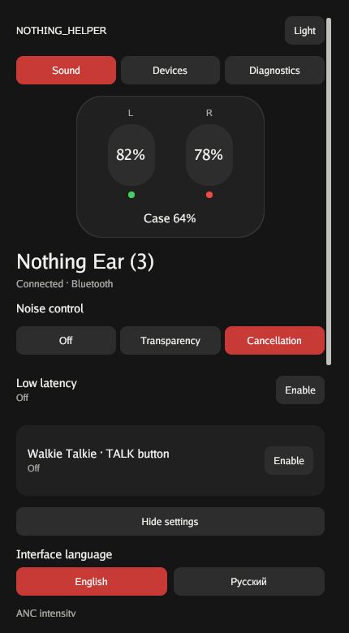
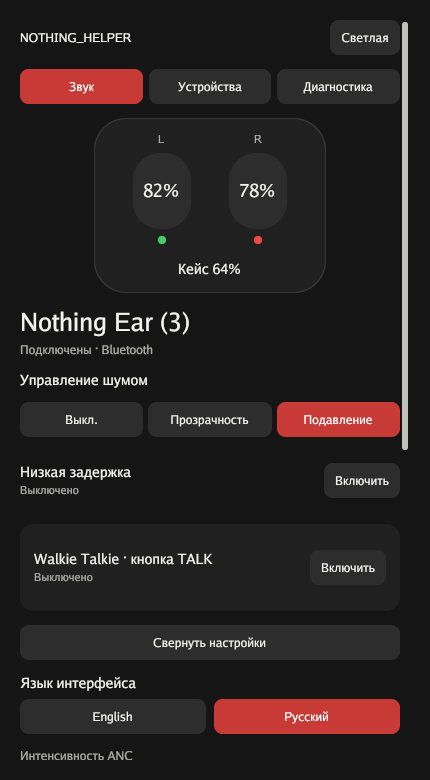
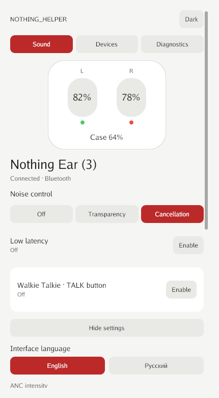
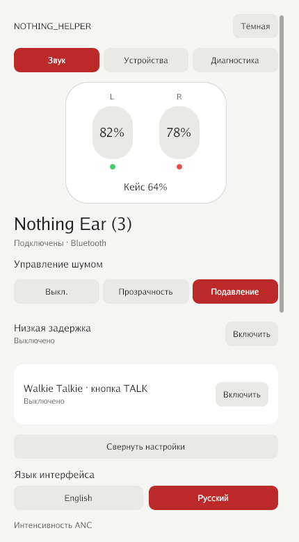

# Клиент для наушников Nothing (community)

Сделан **для владельцев** **Nothing** / **CMF**, кому нужно локальное управление без официального приложения: батарея, ANC, EQ, dual-подключение и остальное по SPP-протоколу устройства.

### Скорее всего работает со всеми поддерживаемыми моделями, но абсолютной гарантии нет — буду рад баг-репортам

<h1 align="center">Nothing_helper</h1>
<p align="center"><strong>Компактное приложение для наушников Nothing / CMF на Linux и macOS. Заряд, ANC, эквалайзер, поиск наушников и управление кнопкой TALK — с компьютера.</strong></p>
<p align="center"><a href="https://github.com/Kuksenok-i-s/nothing_helper/releases/latest">Скачать последнюю версию</a> · <a href="LICENSE">MIT</a></p>

<p align="center"><strong>English</strong> · <strong>Русский</strong></p>
<p align="center">
  
  
</p>

<details>
<summary>Светлая тема — English / Русский</summary>
<p align="center">
  
  
</p>
</details>

Английский и русский интерфейсы с выбором языка внутри «Все настройки». На скриншотах демонстрационные данные; светлая тема доступна в раскрывающемся блоке выше.

Независимый проект сообщества, не связанный с Nothing Technology Limited, возможности зависят от модели.

## Возможности

- **Nothing_helper** (Gio, `-tags gio`) — компактное управление зарядом и звуком, выбор устройств, диагностика
- **Walkie Talkie (Ear (3))** — управление кнопкой TALK на кейсе. Сначала запустите Bluetooth-микрофон в звонке или программе записи; приложение проверит поток и включит Super Mic. Само приложение звук не записывает.
- **Поиск наушников** — нажмите силуэт наушника: сигнал запускается после проверки датчика ношения и автоматически останавливается
- **System tray** (`-tags systray`) - статус, батарея, reconnect из трея
- **Автоподключение** - поиск Nothing/CMF и reconnect при обрыве
- **Парсинг протокола** - батарея (L/R/case), статус, identity, firmware, ANC, EQ, spatial, dual, lag
- **Трассировка** - NDJSON-сессия TX/RX, экспорт в JSON (`captures/`)
- **Desktop-уведомления** - connect/disconnect, батарея, low-battery (`--notify`)
- **Безопасность по умолчанию** - GET-команды и ограниченный набор валидированных UI SET; raw scan и не-UI SET требуют `--unsafe`

## Требования и подготовка

Все команды выполняются из корня репозитория. Нужны **Go 1.26+**, C-компилятор и включённый CGO (`go env CGO_ENABLED` должен вывести `1`). Перед подключением выполните сопряжение наушников в настройках Bluetooth системы. Windows не поддерживается.

### Linux

Debian / Ubuntu:

```bash
make install-deps-debian
```

Arch / Manjaro:

```bash
make install-deps-arch
```

Эти цели устанавливают BlueZ, polkit, заголовки графических библиотек, AppIndicator для трея и инструменты PipeWire. `make install-deps` — алиас только для Debian/Ubuntu. На Debian/Ubuntu установите Go 1.26+ отдельно. В GNOME для иконки трея может понадобиться расширение AppIndicator. Для определения активного микрофона Walkie Talkie используется `pw-dump` из PipeWire.

### macOS

Установите Go 1.26+ и Xcode Command Line Tools (`xcode-select --install`). Bluetooth и строка меню используют системные фреймворки; BlueZ, polkit и AppIndicator нужны только на Linux. Сборка `.app` и универсального DMG описана в [macOS README](packaging/macos/README.md).

## Быстрый старт

```bash
make help
make build          # GUI + трей -> bin/nothing_helper
./bin/nothing_helper
# Или компиляция и запуск одной командой:
make run ARGS="--addr AA:BB:CC:DD:EE:FF --channel 15"
```

Выберите наушники на вкладке «Устройства»; подключение и настройка RFCOMM выполняются в фоне. Исполняемый файл называется `nothing_helper`; окно и приложение macOS называются **Nothing_helper**.

По умолчанию GUI открывается на английском. В **All settings → Interface language** выберите **Русский**; после переключения раздел называется **Все настройки → Язык интерфейса**. Выбор применяется сразу, доступен без подключения наушников и сохраняется в `nothing_helper/interface.json` внутри системного каталога настроек пользователя. Технический журнал остаётся в исходном виде.

## Варианты сборки

```bash
make run-native     # Linux: X11/XWayland и системная рамка окна
make build-native   # такая же сборка -> bin/nothing_helper
make run-lite       # GUI без трея
make build-lite     # такая же сборка -> bin/nothing_helper
make build-package  # GUI + Linux RFCOMM helper -> bin/
```

`run` / `build` используют теги `gio systray`; `run-native` / `build-native` добавляют `nowayland` и требуют X11 либо XWayland на Linux. Обычная сборка поддерживает Wayland и X11. На macOS системная рамка используется при обычном `make run`. Lite-сборке всё ещё нужны графические зависимости Gio, но не нужен AppIndicator на Linux. Варианты перезаписывают один и тот же исполняемый файл.

Эквивалентные команды Go:

```bash
go run -tags "gio systray" ./cmd/nothing_helper
go build -tags "gio systray nowayland" -o bin/nothing_helper ./cmd/nothing_helper
```

Для совместимости сохранены `make run-gio`, `make build-gio`, цели `*-systray`, `*-gio-lite` и `make build-gio-package`. `GUI_TAGS` переопределяет теги обычной GUI-сборки и `check-gui`; например, `make build GUI_TAGS="gio systray nowayland"`.

## Флаги CLI

Флаги `cmd/nothing_helper`:

| Флаг | По умолчанию | Описание |
|------|--------------|----------|
| `--device` | `/dev/rfcomm0` | RFCOMM-устройство (`/dev/rfcomm[0-9]+`) |
| `--addr` | - | MAC Bluetooth; пропускает discovery при bind |
| `--channel` | `15` | RFCOMM-канал при создании `--device` |
| `--model` | - | codename, имя продукта или Fast Pair ID |
| `--log` | auto в `captures/` | путь к NDJSON-трассировке |
| `--log-raw` | `false` | включить raw bytes в лог/экспорт |
| `--capture-dir` | `captures` | каталог JSON-экспорта пакетов |
| `--no-probe` | `false` | не слать identity/battery после connect |
| `--query-every` | `0` (или `60s` при `--notify`) | периодический GET_BATTERY, напр. `30s` |
| `--unsafe` | `false` | разрешить unsafe-операции протокола вне GUI |
| `--auto` | `true` | автопоиск и подключение |
| `--notify` | `true` | desktop-уведомления (нужны `gdbus` или `libnotify` / `notify-send`) |
| `--privilege-helper` | `auto` | backend для privileged операций: `sudo`, `polkit`, `auto`, `none` |
| `--privilege-helper-path` | - | путь к `nothing_helper_rfcomm_helper` для `polkit` |

Пример с трассировкой:

```bash
make run ARGS="--device /dev/rfcomm0 --log captures/session.ndjson --log-raw"
```

## Поддерживаемые устройства

Модель определяется по identity, имени Bluetooth или Fast Pair ID. Можно задать явно: `--model EarThree`.

| Codename | Продукт | Основные фичи |
|----------|---------|---------------|
| EarOne | Nothing ear (1) | anc, eq |
| EarTwo | Ear (2) | anc, eq, dual |
| EarTwos | Nothing Ear (2024) | anc, eq, spatial, dual |
| EarThree | Ear (3) | anc, eq, spatial, dual |
| EarStick | Ear (stick) | eq |
| EarColor | Nothing Ear (a) | anc, eq, spatial, dual |
| Flaffy | Nothing ear (open) | eq, dual |
| Elekid | Nothing Headphone (1) | anc, eq, spatial, dual |
| Forretress | Headphone Pro | anc, eq, spatial, headtrack |
| Crobat | CMF Neckband Pro | anc, eq, spatial |
| Corsola | CMF Buds Pro | anc, eq, spatial |
| Donphan | CMF Buds | eq |
| Espeon | CMF Buds Pro 2 | anc, eq, spatial |
| Girafarig, Gligar, … | codename-модели | см. `internal/spp/models.go` |

Feature-команды в UI: `anc`, `eq`, `spatial`, `lag`, `dual` - с учётом capability конкретной модели.

## Интерфейсы

### Nothing_helper

`make run` открывает новый компактный GUI. «Звук» показывает подтверждённый заряд и ANC; «Все настройки» раскрывает EQ, интенсивность ANC, spatial audio, низкую задержку и dual-подключение с учётом модели. «Устройства» — поиск и подключение, «Диагностика» — техническое состояние и JSON-экспорт. Walkie Talkie доступен на Ear (3) при активном потоке Bluetooth-микрофона. На Linux для проверки нужны PipeWire и `pw-dump`, на macOS используется CoreAudio.

Есть тёмная и светлая темы. С поддержкой трея закрытие окна скрывает его; Open companion возвращает окно, Quit завершает приложение. Без трея закрытие завершает работу. Старый Bubble Tea TUI и прежние экраны Gio удалены.

### System tray

Меню: статус, батарея, refresh, reconnect, disconnect, quit. На GNOME может понадобиться расширение AppIndicator.

## Переход с v1.2.0

В опубликованном v1.2.0 переименованы только файлы для скачивания; внутри них остаются старые имена программы и пакетов. Последующие сборки устанавливают `nothing_helper` и `nothing_helper_rfcomm_helper`. Рецепты Debian, Arch и RPM объявляют замену старого пакета. Обновите собственные команды запуска; для polkit без пароля используется группа `nothing_helper`. После добавления в группу выйдите из сеанса и войдите снова.

Если нового `nothing_helper/devices.json` ещё нет, приложение читает настройки из прежнего `tws_manager/devices.json`; последующие сохранения идут в новый каталог. На macOS изменён идентификатор приложения, поэтому система может снова запросить доступ к Bluetooth.

## Автозапуск и rootless

- Для desktop-автозапуска используется XDG entry: `packaging/common/nothing_helper-autostart.desktop` (`--auto --notify --privilege-helper=polkit`).
- GUI-поток по умолчанию использует `--privilege-helper=auto`: сначала polkit helper, затем sudo fallback с запросом пароля в окне.
- Rootless режим предполагает policy/rules и helper:
  - `packaging/common/org.nothing_helper.rfcomm.policy`
  - `packaging/common/90-nothing_helper.rules`
  - `cmd/nothing_helper_rfcomm_helper`
- **Группа `nothing_helper` обязательна** для автозапуска без polkit-пароля: правило polkit разрешает bind/release/chown только участникам группы. Без группы каждый bind через `pkexec` будет спрашивать пароль администратора.
- После `sudo usermod -aG nothing_helper $USER` нужен **полный logout/login** (перезапуск только GUI недостаточно).
- Проверка: `groups | grep nothing_helper`, затем `pkexec /usr/libexec/nothing_helper_rfcomm_helper bind --number 0 --addr <MAC> --channel 15 --owner $(id -u):$(id -g)` — без диалога пароля и с появлением `/dev/rfcomm0`.

## Безопасность

- По умолчанию - **GET + валидированные UI SET** (ANC/EQ/spatial/lag/dual). Подробности: [SECURITY.md](SECURITY.md).
- `--unsafe` - не-UI SET и ограниченный raw scan (`0xC0xx`, delay ≥ 200 ms, max 32 команды).
- Опасные команды каталога (factory reset, debug mode) **заблокированы всегда**, даже с `--unsafe`.
- `polkit` helper - рекомендуемый режим для GUI/autostart; `sudo` остаётся fallback-режимом.
- Raw bytes в логах - только с `--log-raw`.

## Open Source Readiness

- Публичный репозиторий содержит только исходный код проекта и материалы документации.
- Для сверки протокола используйте собственные логи и результаты наблюдений; не включайте в PR чужой исходный код.
- Лицензия проекта: [LICENSE](LICENSE) (MIT).

## Пакетирование

Готовые packaging-артефакты лежат в `packaging/`:

- `packaging/debian` - debian control/rules/install scripts
- `packaging/arch/PKGBUILD` - Arch/Manjaro package recipe
- `packaging/fedora/nothing_helper.spec` - Fedora RPM spec
- `packaging/macos` - universal `.app` + DMG (только macOS)
- `packaging/common` - общие desktop/polkit/sysusers файлы

Сборка пакетов выполняется на целевой ОС, из корня репозитория:

```bash
make package-deb PKG_VERSION=1.2.2
# dist/nothing-helper_1.2.2-1_<arch>.deb
make bundle-linux PKG_VERSION=1.2.2
# dist/Nothing_helper-1.2.2-linux-<arch>.tar.gz
make macos-app VERSION=1.2.2
# dist/Nothing_helper.app (native architecture)
make package-macos VERSION=1.2.2
# dist/Nothing_helper-1.2.2-universal.dmg (Intel + Apple Silicon)
```

Linux-пакет и архив собираются для архитектуры текущего Go toolchain (`go env GOARCH`). `ARCH` не включает кросс-компиляцию; для arm64 используйте arm64-систему с соответствующими CGO-зависимостями. Архив содержит только GUI и helper, без системных библиотек и установки polkit. `make client-bundle-linux` сохранён как алиас `make bundle-linux`.

Для `.deb` сначала выполните `make install-deps-debian`. Пакеты релиза v1.2.0 собраны на Ubuntu 24.04 и требуют GTK/GLib `t64` (поколение Ubuntu 24.04 / Debian 13).

Для Arch установите зависимости через `make install-deps-arch`, задайте `pkgver` в `packaging/arch/PKGBUILD`, затем выполните `make package-arch`. Результат: `dist/nothing_helper-<pkgver>-1-<arch>.pkg.tar.zst`.

RPM — отдельный рецепт для Fedora: `make package-rpm` требует настроенного дерева `rpmbuild`, версии в `packaging/fedora/nothing_helper.spec` и исходного архива `nothing_helper-<version>.tar.gz` в его каталоге `SOURCES`. Результаты находятся в каталоге `RPMS` дерева rpmbuild; в релиз v1.2.0 RPM не входит.

Для локальной сборки задавайте версию явно, как выше. Без неё Debian и Linux-архив используют `APP_VERSION`, тег из `GITHUB_REF` в CI либо `0.0.0~dev.<sha>`; локальный checkout тега сам по себе не задаёт версию. Скрипты macOS без `VERSION` используют `1.2.2`. Версию Arch/RPM задаёт соответствующий рецепт.

### Post-install (rootless)

- **Debian/Ubuntu (`.deb`)**: `postinst` пытается автоматически создать группу `nothing_helper` и добавить пользователя. Если не удалось, выводит ручную команду `usermod`.
- **Arch/Manjaro**: пользователь в группу **не добавляется автоматически** (в отличие от `.deb`). После установки пакета выполните `sudo usermod -aG nothing_helper $USER` и перелогиньтесь — иначе autostart будет запрашивать polkit-пароль и не создаст `/dev/rfcomm0` для SPP-сессии.
- **Fedora/RPM**: создаётся группа через `sysusers`, а `post` выводит инструкции по добавлению пользователя в `nothing_helper`.

## Структура проекта

```
cmd/nothing_helper/          Companion entrypoint
cmd/nothing_helper_rfcomm_helper/ privileged helper for polkit
internal/
  app/                    флаги, bootstrap, shutdown
  session/                RFCOMM-сессия, read loop, probe
  spp/                    wire-формат, команды, парсеры, модели
  bt/                     bluetoothctl, rfcomm, discovery
  connect/                autodiscover, bind, reconnect
  notify/                 desktop notifications
  trace/                  NDJSON лог, redaction
  security/               валидация MAC, путей, канала
  ui/companion/                 Gio GUI
  ui/tray/                system tray
  ui/presenter/           общий каталог команд для Companion
```

Карта для агентов и инварианты: [AGENTS.md](AGENTS.md).

## Разработка

```bash
make fmt
make check          # vet + tests + race tests
make check-gui      # vet + race tests with gio systray
# Linux X11/XWayland:
make check-gui GUI_TAGS="gio systray nowayland"
go test ./internal/spp -run Test
go test ./internal/session -run Test
```

После изменений в `cmd/` или `internal/` имеет смысл прогнать полный тестовый набор перед коммитом.

## CI / релизы

GitHub Actions в `.github/workflows/`:

| Workflow | Триггер | Что делает |
|----------|---------|------------|
| `ci.yml` | push, pull_request | Linux vet/build/test-race; macOS vet/build/test; smoke-сборка Debian `.deb` (amd64) |
| `release-client-linux.yml` | tag `v*`, вручную | `.deb` (amd64/arm64), Arch pkg (x86_64), portable tarball; публикация в GitHub Releases |
| `release-client-macos.yml` | tag `v*`, вручную | Universal macOS DMG; публикация в GitHub Releases |

Релиз:

```bash
git tag -a v1.2.3 -m "Nothing_helper v1.2.3"  # example: choose an unused version
git push origin v1.2.3
```

Оба release-workflow прикрепляют артефакты к одному черновику GitHub Release; публикуйте его после проверки всех сборок (`Nothing_helper v<version>`). Ручной запуск: **Actions → Release Linux client / Release macOS client → Run workflow** (опционально переопределить версию).

## Ограничения

- **Linux** — основная платформа (BlueZ, `/dev/rfcommN`, polkit helper).
- **macOS** — экспериментально (IOBluetooth RFCOMM, Gio GUI).
- Не замена официального приложения: OTA, персонализация жестов и часть фич не реализованы.
- Протокол восстановлен по наблюдаемому трафику и поведению устройств; поведение на непроверенных моделях может отличаться.
