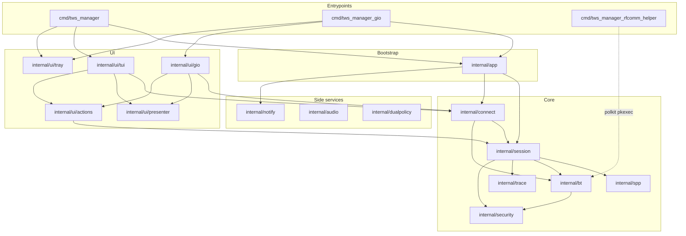
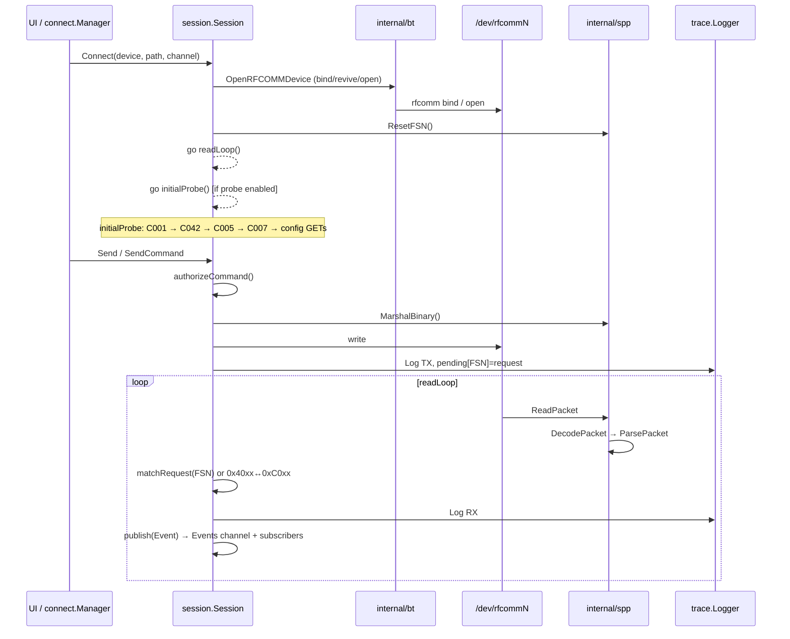

# Architecture

## Layer diagram

## Runtime data flow

## Bootstrap lifecycle (`internal/app`)

1. **`RegisterFlags` / `ConfigFromFlags`** — TUI: `--auto=false`, `--notify=false`, `--privilege-helper=sudo`. Gio: `--auto=true`, `--notify=true`, `--privilege-helper=auto`.
2. **`Bootstrap`** — `trace.Logger` + `session.Session` + optional battery polling.
3. **`WireServices`** — privileges, `connect.Manager`, optional `notify.Run`.
4. **`Run`** — user callback; shutdown on ctx cancel.

**Agent tip:** new global behaviour usually starts in `flags.go` → `config.go` → `bootstrap.go` or `entry.go`.

Key files: `bootstrap.go`, `entry.go`, `shutdown.go`, `flags.go`, `config.go`.
