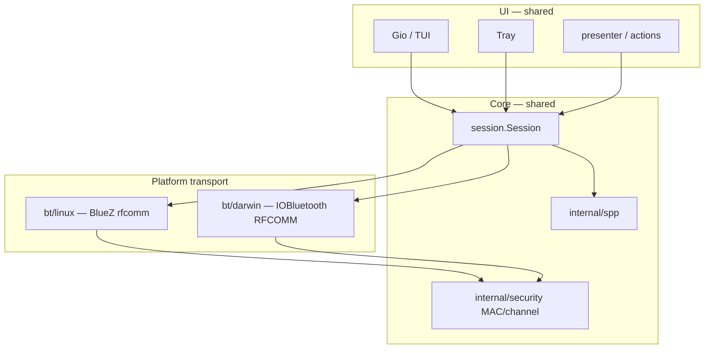

# macOS adaptation — research findings

Research-only document (no production code changes yet). Goal: decide whether and how to port the Linux-only tws_manager client to macOS across Bluetooth, tray, and GUI.

**Gate:** macOS must expose a reliable Classic Bluetooth SPP/RFCOMM byte stream compatible with existing `internal/session` and `internal/spp` layers.

---

## Executive summary

| Area | Verdict | Confidence |
|------|---------|------------|
| **Classic Bluetooth SPP** | **Conditional GO** — feasible via `IOBluetooth` RFCOMM API; hardware spike required | Medium (API documented; Nothing/CMF channel 15 unverified on macOS) |
| **GUI (Gio)** | **GO** — builds once Linux-only `internal/bt` is gated; no Vulkan on macOS | High (Gio supports macOS natively) |
| **System tray** | **GO with bundle work** — `getlantern/systray` supports macOS; needs `.app` bundle + icon | High |
| **Notifications** | **Stub/replace** — no `gdbus`/`notify-send`; use `osascript` or UserNotifications | High |
| **Audio readiness** | **Stub on macOS** — no PulseAudio/PipeWire `bluez_output.*` sinks | High |
| **Privileges** | **N/A** — no `sudo`/`polkit`/`rfcomm bind`; TCC + optional code signing instead | High |
| **Packaging** | **New track** — `.app` bundle, entitlements, notarization; no `.deb`/polkit | High |

**Overall recommendation:** Proceed with a **Bluetooth-first spike** (PR 1–3 below). Do not invest in tray polish or distribution until GET_BATTERY round-trip succeeds on paired Nothing/CMF hardware.

---

## 1. Linux-only assumptions map

### Bluetooth / RFCOMM (`internal/bt`)

| Assumption | Linux implementation | macOS impact |
|------------|---------------------|--------------|
| Discovery | `bluetoothctl devices Paired/Connected`, `bluetoothctl info` | Replace with `IOBluetoothDevice.pairedDevices()` + SDP/service UUID scan |
| RFCOMM bind | `rfcomm bind N MAC CHANNEL` | **No equivalent** — open RFCOMM channel directly on paired device |
| Device node | `/dev/rfcommN` TTY | Optional `/dev/cu.*` exists after pairing but **unreliable for TX/RX** (see §2) |
| Open transport | `unix.Open`, `TIOCM_CD` carrier poll, raw termios (`TCGETS`/`TCSETS`) | IOBluetooth delegate callbacks; blocks current macOS `go build` (undefined syscalls) |
| Privileges | `sudo`, `pkexec`, `tws_manager_rfcomm_helper`, chown/chmod on TTY | Not needed; Bluetooth permission via TCC |
| Revive stale link | `rfcomm release` + re-bind + permission fix | Explicit RFCOMM channel close + reopen; macOS `bluetoothd` reconnect bugs documented |
| Config persistence | `~/.config/tws_manager/` maps `/dev/rfcommN` → MAC + channel | Store MAC → channel only; drop path-based keys on Darwin |
| SPP UUID | `AEAC4A03-DFF5-498F-843A-34487CF133EB` in `bluetoothctl info` | Query via SDP on `IOBluetoothDevice` |
| Default channel | 15 | Same default; confirm via SDP spike |

### Session / security (`internal/session`, `internal/security`)

| Assumption | Detail | macOS impact |
|------------|--------|--------------|
| Connect signature | `Connect(device, rfcommPath, channel)` | Generalize to transport handle or `io.ReadWriteCloser` + MAC |
| Path validation | `ValidateRFCOMMDevice` — only `/dev/rfcommN` | Darwin validator: MAC + channel range; reject arbitrary paths |
| Transport field | `s.f *os.File` | Change to `io.ReadWriteCloser` (read loop already uses `io.Reader`) |
| Idempotent reconnect | Same MAC while live → no-op | Preserve unchanged |
| Safety invariants | `authorizeCommand`, scan limits, raw redaction | **Unchanged** — no transport coupling |

### Connect layer (`internal/connect`)

| Assumption | Detail | macOS impact |
|------------|--------|--------------|
| `RFCOMMExists()` | `os.Stat(/dev/rfcommN)` | Replace with “transport open” or “device paired + ACL up” |
| `Bind()` | calls `bt.BindRFCOMMWithProbe` | Darwin: `OpenRFCOMMChannel` with channel probe only |
| Default `--device` | `/dev/rfcomm0` | Darwin default: empty or `bt://MAC` opaque handle |

### Tray (`internal/ui/tray`)

| Assumption | Detail | macOS impact |
|------------|--------|--------------|
| Backend | `getlantern/systray` (Linux: AppIndicator) | Same library; macOS uses `NSStatusItem` |
| Icon | **Not set** — title text only (`SetTitle`) | macOS menu bar needs `SetIcon` + template PNG or `.icns` |
| Bundle | N/A on Linux | **Required** `.app` wrapper for reliable menu bar icon |
| Event loop | `systray.Run` in goroutine + Gio `app.Main()` on main thread | Same pattern documented for macOS; verify on hardware |

### GUI (`internal/ui/gio`, `cmd/tws_manager_gio`)

| Assumption | Detail | macOS impact |
|------------|--------|--------------|
| Build tag | `gio` | Same; **no** `vulkan-headers` on macOS |
| Hide-to-tray | `hideToTray()` true when `gio && systray` | Works conceptually; depends on tray bundle (§4) |
| Sudo prompt UI | Gio modal for `sudo -S` | Remove/stub on Darwin (`PrivilegeModeNone`) |

### Notifications (`internal/notify`)

| Assumption | Detail | macOS impact |
|------------|--------|--------------|
| Backends | `gdbus` (freedesktop), fallback `notify-send` | Use `osascript display notification` or `UserNotifications` framework |
| In-place update | gdbus replace ID | Re-post or track notification ID if API allows |

### Audio readiness (`internal/audio`)

| Assumption | Detail | macOS impact |
|------------|--------|--------------|
| Default sink check | `pactl` / `wpctl`, prefix `bluez_output.XX_...` | Stub: always “unknown” or CoreAudio output device name match (future) |

### Dual policy / host MAC (`internal/dualpolicy`)

| Assumption | Detail | macOS impact |
|------------|--------|--------------|
| Host adapter MAC | `bluetoothctl show` | IOBluetooth host controller address API or system_profiler fallback |

### Privileges / helper (`internal/bt/privilege.go`, `cmd/tws_manager_rfcomm_helper`)

| Assumption | Detail | macOS impact |
|------------|--------|--------------|
| Modes | `sudo`, `polkit`, `auto`, `none` | Darwin: fixed `none`; helper binary not shipped |
| GUI warmup | `WarmupSudo`, Gio password modal | No-op on Darwin |

### Packaging / bootstrap

| Assumption | Detail | macOS impact |
|------------|--------|--------------|
| Distro packages | Debian/Arch/Fedora, polkit, udev, `.desktop` | `.app` + optional Homebrew cask |
| `--privilege-helper` default | TUI: `sudo`; Gio: `auto` | Darwin default: `none` |
| Build | `make install-deps-debian`, BlueZ | Xcode CLI tools only for Gio + CGO Bluetooth |

### Build verification (this research session, darwin arm64)

```
go build -tags gio ./cmd/tws_manager_gio
# FAIL: internal/bt/bt.go — undefined unix.TCGETS / unix.TCSETS
```

Confirms `internal/bt` is Linux-only today and blocks any macOS compile.

---

## 2. macOS Classic Bluetooth SPP/RFCOMM feasibility

### Go / no-go

**Conditional GO** for Classic SPP on macOS:

- **GO:** Apple documents and supports Classic Bluetooth RFCOMM via the **IOBluetooth** framework (`IOBluetoothDevice.openRFCOMMChannelAsync`, `IOBluetoothRFCOMMChannel` read/write delegates). Nothing/CMF control uses standard SPP over RFCOMM channel 15 with a known service UUID — same profile class macOS supports for paired audio/accessory devices.
- **NO for CoreBluetooth:** `tinygo.org/x/bluetooth` and CoreBluetooth are **BLE-only**. Nothing/CMF SPP control is **Classic Bluetooth**, not GATT. CoreBluetooth is not a substitute.
- **NO for raw `/dev/cu.*`:** Community evidence (MacRats TH-D75, RN4678/STM32 reports) shows serial device nodes can open but **fail to carry data** or **silence RX after reconnect** until `bluetoothd` restart. Apple recommends the RFCOMM API over POSIX serial emulation.
- **BLOCKED until spike:** No Nothing/CMF hardware was available in this research environment. Channel 15 and UUID visibility on macOS SDP must be confirmed on real earbuds.

### Recommended macOS transport API

```
IOBluetoothDevice (paired) 
  → openRFCOMMChannelAsync(channelID: 15, delegate:)
  → IOBluetoothRFCOMMChannelDelegate.rfcommChannelData
  → writeAsync / writeSync for TX
```

Implementation path for Go: **CGO + Objective-C bridge** (no mature pure-Go IOBluetooth library). Pattern: small `internal/bt/darwin/` package with C/ObjC shim, Go wrapper implementing `io.ReadWriteCloser`.

### Permissions and distribution

| Requirement | Notes |
|-------------|-------|
| `NSBluetoothAlwaysUsageDescription` in `Info.plist` | Required since Big Sur; crash without it |
| TCC prompt | First Bluetooth API use; user grants in System Settings → Privacy → Bluetooth |
| `com.apple.security.device.bluetooth` entitlement | Needed for sandboxed/distributed builds; `IOBluetoothDevice.pairedDevices()` may return empty without it |
| Code signing + notarization | Recommended for Gatekeeper; ad-hoc sign OK for local dev |
| Run loop | CLI/headless tools must run `CFRunLoop`/`NSRunLoop` for RFCOMM delegate delivery |

### Known risks

1. **Reconnect reliability** — macOS `bluetoothd` RFCOMM state can stick after disconnect (documented for third-party SPP devices). Mitigation: explicit channel close, backoff, user-facing “toggle Bluetooth” hint.
2. **IOBluetooth deprecation** — Apple steers new apps to CoreBluetooth (BLE). Classic RFCOMM remains available but is legacy; acceptable for a desktop accessory tool, not App Store–friendly long term.
3. **CGO complexity** — cross-compilation from Linux CI impossible; macOS builds require macOS runner.
4. **Dual connection** — earbuds may already hold an ACL for A2DP; RFCOMM open must coexist (usually fine for BR/EDR accessories).

### Hardware spike procedure (when hardware available)

Prerequisites: Nothing/CMF earbuds paired in System Settings → Bluetooth; Xcode CLI tools installed.

Build and run the spike tool:

```bash
go build -o bin/spp_spike ./cmd/spp_spike
./bin/spp_spike --addr AA:BB:CC:DD:EE:FF --channel 15
```

Steps:

1. **SDP / UUID check** — Run discovery in the GUI or inspect `bt.Discover()` output. Confirm UUID `AEAC4A03-DFF5-498F-843A-34487CF133EB` and RFCOMM channel (expect 15).
2. **Open channel** — `spp_spike` opens RFCOMM channel 15 via IOBluetooth; wait for success log line.
3. **Send safe command** — Spike TX frame for `GET_BATTERY` (`0xC007`) built with `internal/spp` `MarshalBinary`.
4. **Receive & parse** — Read bytes from transport; pass through `spp.DecodePacket` → `spp.ParsePacket`. Expect parseable battery response within 5 s (default `--timeout`).
5. **Reconnect test** — Disconnect (close channel), reconnect 3× without restarting `bluetoothd`. Log whether RX resumes.
6. **Record** — NDJSON trace with `--log-raw`; note macOS version, ear model, success/fail per step.

**Spike pass criteria:** Steps 2–4 succeed once; step 5 succeeds at least 2/3 attempts.

**Spike fail → project NO-GO** for full port (CLI-only investigation may still be worthwhile).

---

## 3. Proposed platform boundary

Preserve package boundaries from [architecture.md](architecture.md): protocol in `internal/spp`, orchestration in `internal/session`, transport in `internal/bt`.

### Transport interface (new, shared)

```go
// internal/bt/transport.go (conceptual)
type Transport interface {
    io.ReadWriteCloser
    RemoteMAC() string
    Channel() int
    // String returns a stable log label (e.g. "/dev/rfcomm0" or "rfcomm:AA:BB:…:15")
    String() string
}
```

Platform files:

| File / tag | Responsibility |
|------------|----------------|
| `internal/bt/linux/*.go` `//go:build linux` | Current `bt.go` logic: bluetoothctl, rfcomm, sudo/polkit, TTY open |
| `internal/bt/darwin/*.go` `//go:build darwin` | IOBluetooth discovery, RFCOMM open/close, CGO bridge |
| `internal/bt/device.go` | Shared `Device`, `Config`, `NothingSPPUUID`, channel resolve |
| `internal/security/validate_linux.go` | `ValidateRFCOMMDevice` (unchanged rules) |
| `internal/security/validate_darwin.go` | `ValidateTransportRef(ref string)` — opaque `rfcomm:<MAC>:<channel>` or MAC-only |

### Session changes (minimal)

- Replace `f *os.File` with `transport io.ReadWriteCloser` (or `bt.Transport`).
- `Connect(device bt.Device, transportRef string, channel int)`:
  - Linux: `transportRef` = `/dev/rfcommN` (validated as today).
  - Darwin: `transportRef` = MAC or canonical `rfcomm:MAC:CH`; `bt.OpenTransport` ignores path-shaped nodes.
- `readLoop(r io.Reader)` — already compatible.
- **Invariants unchanged:** `authorizeCommand`, scan limits, FSN pending map, idempotent same-MAC connect, raw redaction.

### Connect / app layer

- `connect.Manager`: platform-specific `Discover`, `Bind`/`Open`, `RFCOMMExists` → `TransportReady`.
- `internal/app/flags.go`: Darwin defaults — `--device` optional, `--privilege-helper=none`.
- Remove Darwin imports of `tws_manager_rfcomm_helper`.

### What stays shared (no fork)

`internal/spp`, `internal/trace`, `internal/ui/presenter`, `internal/ui/actions`, `internal/ui/gio` (view/state), `internal/ui/tui`, safety catalog, model/feature gating.



---

## 4. Tray and GUI viability

### Gio GUI

| Check | Result |
|-------|--------|
| Vulkan dependency | Linux-only; macOS uses native Metal/OpenGL via Gio |
| `go build -tags gio` | **Blocked today** by Linux `internal/bt` — not by Gio itself |
| Window lifecycle | Existing `app.Main()` + window goroutine pattern matches Gio macOS expectations |
| Hide-to-tray | Implemented via `errWindowHidden` + `ShowCh`; disable until tray bundle verified (`hideToTray()` stub already exists in `tray_hide_stub.go`) |

**Gio-only smoke test (after PR 1 linux/darwin split):**

```bash
go build -tags gio -o bin/tws_manager_gio ./cmd/tws_manager_gio
./bin/tws_manager_gio --auto=false --privilege-helper=none
# Expect: window opens; device list empty or error without Bluetooth backend
```

### System tray (`getlantern/systray` v1.2.2)

| Check | Result |
|-------|--------|
| macOS support | Documented — Windows, macOS, Linux |
| Current code gaps | No `SetIcon`; title-only menu bar item |
| Bundle | **Required** — `App.app/Contents/{Info.plist,MacOS/binary,Resources/icon.icns}` |
| Info.plist keys | `LSUIElement=1` (menu bar only, no Dock); `NSHighResolutionCapable=true` |
| Bluetooth privacy | Add `NSBluetoothAlwaysUsageDescription` to same plist if tray/GUI triggers BT |
| Coexistence with Gio | Current design: `systray.Run` in goroutine, `app.Main()` on main — matches systray macOS guidance |

**Tray smoke test (after bundle + icon PR):**

```bash
# Build with systray tag, place in .app bundle (script TBD)
open tws_manager.app
# Menu bar icon visible; menu shows Disconnected / Battery / Quit
# Quit exits process; Show window raises Gio window
```

**Tray UX note:** macOS favors icon + tooltip over long `SetTitle` text. Add embedded PNG icon (16×16@2x template) and move battery summary to tooltip/submenu.

---

## 5. Feasibility matrix

| Component | Feasibility | Effort | Risk | Depends on |
|-----------|-------------|--------|------|------------|
| Darwin bt transport (CGO) | High | **L** | Medium | Hardware spike |
| session `io.ReadWriteCloser` refactor | High | S | Low | — |
| security validation split | High | S | Low | — |
| connect.Manager Darwin | High | M | Low | bt transport |
| notify Darwin stub | High | S | Low | — |
| audio Darwin stub | High | S | Low | — |
| dualpolicy host MAC | Medium | S | Low | IOBluetooth or system_profiler |
| Gio macOS build/run | High | S | Low | bt split |
| Tray bundle + icon | High | M | Low | — |
| Hide-to-tray integration | Medium | S | Medium | Tray smoke pass |
| Homebrew / .app packaging | High | M | Medium | Code signing |
| TUI on macOS | Low value | S | — | Same bt backend; deprioritize |

**Effort key:** S = small PR, M = medium, L = large.

---

## 6. Implementation roadmap (PR-sized)

| PR | Scope | Outcome |
|----|-------|---------|
| **1** | `//go:build linux` on existing `internal/bt/*.go`; add `darwin/stub.go` returning clear errors; fix macOS compile | `go build ./...` succeeds on Darwin (stub bt) |
| **2** | Introduce `bt.Transport` interface; session uses `io.ReadWriteCloser`; Linux behavior identical | Tests green; no protocol change |
| **3** | **Hardware spike** — `cmd/spp_spike` or ObjC tool: open RFCOMM 15, GET_BATTERY, parse | Go/no-go decision recorded |
| **4** | `internal/bt/darwin` IOBluetooth CGO transport (discover, open, read, write, close) | Real connect on macOS |
| **5** | `internal/security` Darwin validator; `connect.Manager` + app flags Darwin defaults | End-to-end connect from Gio/TUI stub |
| **6** | `internal/notify/darwin` + `internal/audio` stub + `dualpolicy` host MAC | Feature parity gaps closed |
| **7** | Gio macOS smoke fixes; `--privilege-helper=none`; disable sudo UI on Darwin | GUI usable |
| **8** | Tray: `SetIcon`, `.app` bundle template, `LSUIElement`, plist Bluetooth strings | Menu bar tray works |
| **9** | Hide-to-tray re-enable on Darwin; integration test recipe | Gio + tray lifecycle |
| **10** | `packaging/macos/` — bundle script, ad-hoc sign, README macOS section | Installable artifact |

Stop after **PR 3** if spike fails.

---

## 7. Manual test checklist (macOS)

### Bluetooth / protocol

- [ ] Paired Nothing/CMF device appears in discovery list
- [ ] SPP UUID shown in device info (if UI exposes it)
- [ ] Connect opens RFCOMM channel 15 without `sudo`
- [ ] Initial probe completes (protocol version, firmware, identity, battery)
- [ ] GET_BATTERY returns parsed L/R/case percents
- [ ] Safe SET commands work (ANC/EQ toggles per model)
- [ ] Unsafe command blocked without `--unsafe`
- [ ] Scan mode respects GET-only, ≥200 ms delay, max 32 commands
- [ ] Disconnect closes channel cleanly
- [ ] Reconnect 3× without restarting Bluetooth — RX still works
- [ ] Idempotent reconnect (same MAC, live session) does not wedge device
- [ ] NDJSON trace written; raw bytes absent without `--log-raw`
- [ ] Low-battery notification fires at 20/10/5% (when notify enabled)

### GUI

- [ ] `go build -tags gio` succeeds on macOS
- [ ] Window open / resize / close
- [ ] Device list populates after Discover
- [ ] Connect / Disconnect buttons work
- [ ] Control page commands match Linux behavior
- [ ] Log page shows TX/RX summaries
- [ ] Quit terminates process (no zombie `app.Main`)

### Tray

- [ ] App runs from `.app` bundle (not bare binary)
- [ ] Menu bar icon visible (not blank/default)
- [ ] Status and battery menu items update on connect
- [ ] Refresh battery sends GET_BATTERY
- [ ] Reconnect triggers auto-connect flow
- [ ] Show window raises Gio window after hide-to-tray
- [ ] Quit from tray exits cleanly

### Permissions / distribution

- [ ] First run shows Bluetooth permission prompt (expected copy)
- [ ] Denied permission → actionable error in UI/log
- [ ] Ad-hoc signed build runs locally
- [ ] Notarized build (if applicable) passes Gatekeeper

---

## 8. References

- Apple IOBluetooth RFCOMM: [openRFCOMMChannelAsync](https://developer.apple.com/documentation/iobluetooth/iobluetoothdevice/openrfcommchannelasync(_:withchannelid:delegate:))
- Apple Bluetooth programming guide (RFCOMM over serial): archived [Developing Bluetooth Applications](https://developer.apple.com/library/archive/documentation/DeviceDrivers/Conceptual/Bluetooth/BT_Develop_BT_Apps/BT_Develop_BT_Apps.html)
- MacRats Bluetooth SPP (IOBluetooth vs `/dev/cu.*`): [w9fyi/macrats](https://github.com/w9fyi/macrats)
- getlantern/systray macOS bundle: [README](https://github.com/getlantern/systray/blob/master/README.md)
- Project SPP UUID / channel: `internal/bt/bt.go` (`NothingSPPUUID`, default channel 15)
- Linux architecture baseline: [architecture.md](architecture.md), [packages.md](packages.md)

---

*Research completed 2026-06-22. No production Go code changed.*
